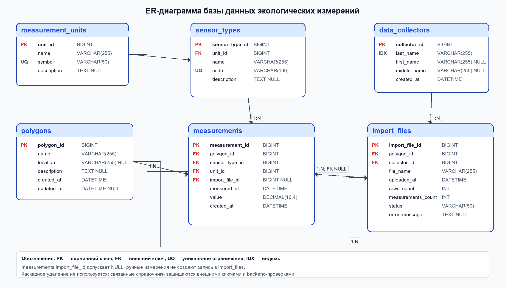
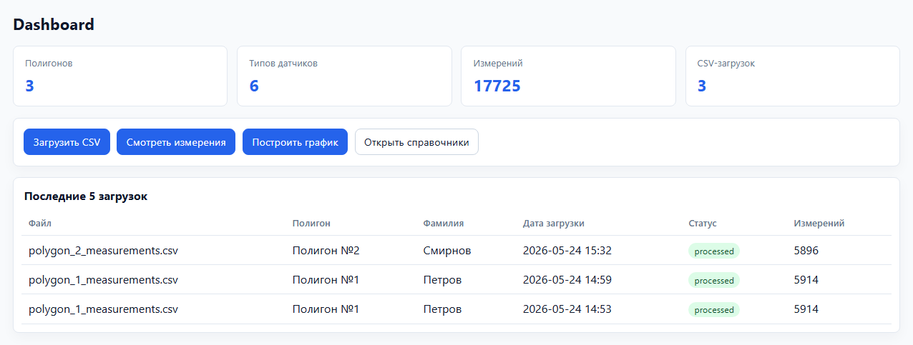
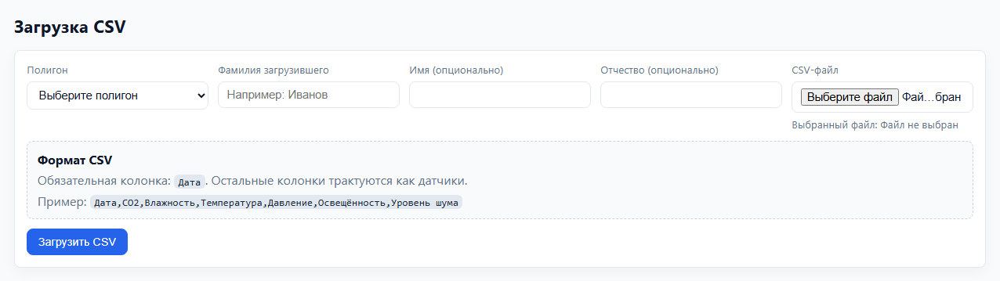
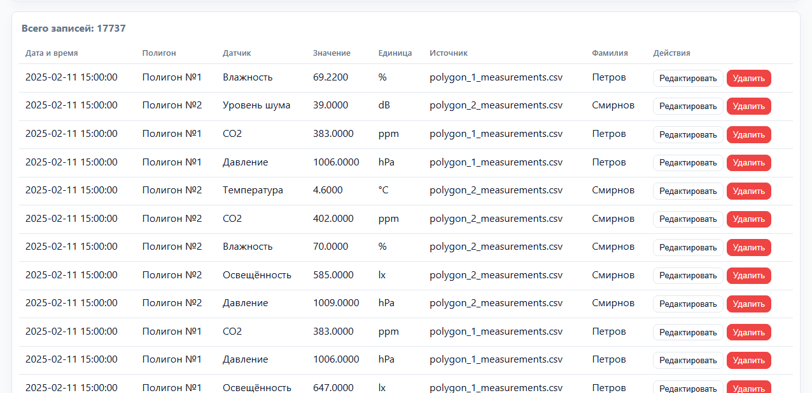
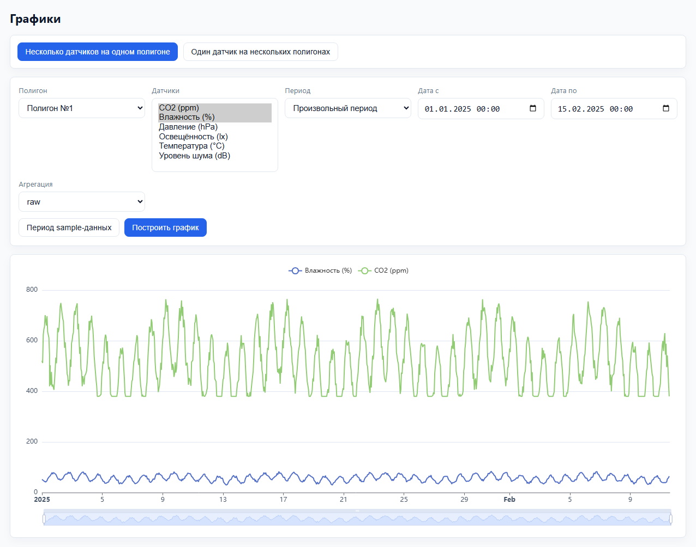
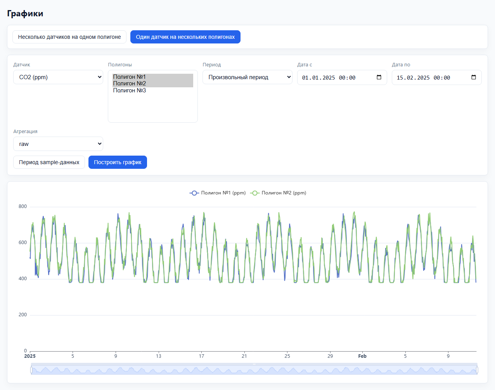
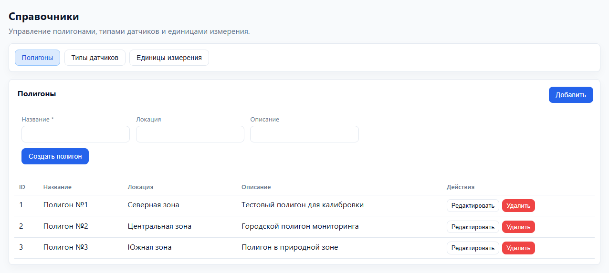
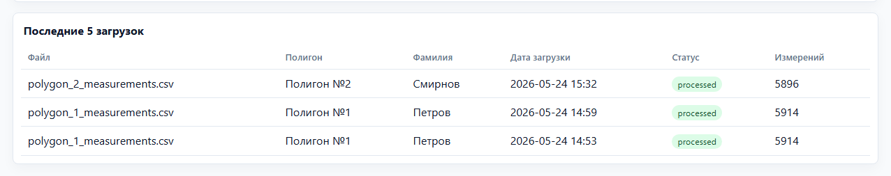

# Введение

Экологический мониторинг связан с регулярным сбором числовых показателей состояния окружающей среды. Для анализа таких данных необходимо хранить не только сами значения, но и сведения о месте наблюдения, типе показателя, единице измерения, времени измерения и происхождении записи. Если данные остаются в отдельных CSV-файлах, возникает несколько практических проблем: файлы трудно сравнивать между собой, сложно быстро фильтровать измерения по периоду и полигону, неудобно строить графики и контролировать историю загрузок.

Тема курсовой работы является актуальной, поскольку сетевые базы данных позволяют централизованно хранить экологические измерения и предоставлять к ним доступ через веб-приложение. В разработанном проекте база данных размещается в MySQL, а пользователь работает с ней через frontend-интерфейс. Это позволяет выполнять импорт CSV-файлов, просматривать измерения, применять фильтры, строить графики, сравнивать полигоны, а также вручную добавлять, редактировать и удалять отдельные записи.

Цель курсовой работы — разработать базу данных и веб-приложение для хранения и анализа экологических измерений, собираемых на разных полигонах.

Для достижения цели были поставлены следующие задачи:

- изучить предметную область экологических измерений;
- определить формат исходных CSV-данных;
- спроектировать нормализованную структуру базы данных MySQL;
- реализовать таблицы, первичные и внешние ключи, индексы и ограничения;
- обеспечить импорт широкого CSV-формата в нормализованную таблицу измерений;
- реализовать просмотр, фильтрацию и построение графиков;
- реализовать ручное добавление, редактирование и удаление измерений;
- реализовать управление справочниками полигонов, типов показателей и единиц измерения;
- обеспечить защиту связанных справочных данных от некорректного удаления.

Объектом работы являются экологические измерения, собираемые на полигонах. Предметом работы является структура сетевой базы данных и программные механизмы доступа к ней через веб-приложение.

В проекте используются MySQL 8, FastAPI, SQLAlchemy ORM, Alembic, Angular, TypeScript, Apache ECharts и Docker Compose. Отчет включает анализ предметной области, проектирование базы данных, описание физической реализации, backend-уровень работы с MySQL, пользовательский интерфейс, SQL-запросы и итоговые выводы.

# 1. Анализ предметной области и постановка задачи

## 1.1. Описание предметной области экологических измерений

В предметной области рассматривается несколько экологических полигонов. На каждом полигоне регулярно собираются значения показателей окружающей среды: CO2, влажность, температура, давление, освещенность, уровень шума и другие величины, если они заведены в справочнике типов показателей.

В реализованной модели тип показателя описывает измеряемую величину, а не физическое устройство. Поэтому в базе данных нет отдельной сущности физического датчика и нет привязки устройств к полигонам. Факт наблюдения определяется полигоном, типом показателя, единицей измерения, датой и временем, а также числовым значением.

Данные могут попадать в систему двумя способами. Первый способ — загрузка CSV-файла, подготовленного человеком. При загрузке пользователь выбирает полигон и указывает фамилию загрузившего. Второй способ — ручное добавление отдельного измерения через форму на странице измерений. Оба способа создают записи в одной таблице `measurements`, поэтому такие данные участвуют в общих фильтрах, таблицах и графиках.

## 1.2. Формат исходных данных

Исходные CSV-файлы имеют широкий формат. Одна строка соответствует одному моменту времени, а отдельные столбцы после даты соответствуют разным показателям.

```csv
Дата,CO2,Влажность,Температура,Давление,Освещённость,Уровень шума
2025-01-01 00:00:00,420,55,21.4,1008,610,38
```

При импорте широкий формат преобразуется в длинный формат. Если строка CSV содержит дату и шесть заполненных показателей, в таблице `measurements` создается шесть строк. В каждой строке хранится один показатель, его значение, время измерения, полигон, единица измерения и ссылка на файл импорта.

Ручная запись создается без CSV-файла. В этом случае пользователь указывает полигон, тип показателя, время и значение, а единица измерения определяется автоматически по выбранному типу показателя.

## 1.3. Требования к базе данных

База данных должна выполнять следующие функции:

- хранить полигоны экологического мониторинга;
- хранить загрузивших CSV-файлы сотрудников;
- хранить единицы измерения;
- хранить типы измеряемых показателей;
- хранить журнал загрузок CSV-файлов;
- хранить импортированные и ручные измерения в общей таблице;
- допускать `NULL` в `measurements.import_file_id` для ручных записей;
- определять единицу измерения ручной записи через выбранный тип показателя;
- поддерживать фильтрацию по полигону, типу показателя, периоду и файлу импорта;
- поддерживать выборки для построения графиков и сравнения полигонов;
- предотвращать удаление справочных записей, если они используются существующими измерениями или загрузками;
- сохранять ссылочную целостность при операциях добавления, редактирования и удаления.

Структура базы данных должна быть нормализована до третьей нормальной формы. Названия полигонов, типов показателей и единиц измерения не должны дублироваться текстом в таблице измерений.

## 1.4. Требования к веб-приложению

Веб-приложение должно предоставлять пользователю следующие возможности:

- просмотр сводки на Dashboard;
- загрузка CSV-файлов с выбором полигона и указанием загрузившего;
- просмотр таблицы измерений;
- фильтрация измерений по полигону, типу показателя, периоду и файлу импорта;
- ручное создание, редактирование и удаление измерений;
- отображение источника записи: имя CSV-файла или «Введено вручную»;
- построение графика нескольких показателей на одном полигоне;
- сравнение одного показателя на нескольких полигонах;
- создание, редактирование и удаление полигонов;
- создание, редактирование и удаление типов показателей;
- создание, редактирование и удаление единиц измерения;
- вывод понятного сообщения, если удаление справочной записи невозможно из-за связанных данных.

# 2. Проектирование базы данных

## 2.1. Выделение основных сущностей предметной области

Логическая модель построена вокруг факта экологического измерения. В проекте выделены шесть таблиц: `polygons`, `data_collectors`, `measurement_units`, `sensor_types`, `import_files` и `measurements`.

`polygons` хранит полигоны наблюдения. `data_collectors` хранит фамилии людей, загружавших CSV-файлы. `measurement_units` хранит единицы измерения. `sensor_types` хранит типы измеряемых показателей и связывает каждый тип с единицей измерения. `import_files` фиксирует факт загрузки CSV-файла. `measurements` хранит нормализованные значения измерений.

## 2.2. Описание таблиц базы данных

| Таблица | Назначение |
| --- | --- |
| `polygons` | Справочник экологических полигонов. |
| `data_collectors` | Справочник загрузивших CSV-файлы сотрудников. |
| `measurement_units` | Справочник единиц измерения. |
| `sensor_types` | Справочник типов измеряемых показателей; каждый тип связан с единицей измерения. |
| `import_files` | Журнал CSV-загрузок: файл, полигон, загрузивший, статус и количество обработанных строк. |
| `measurements` | Основная таблица фактов измерений: полигон, тип показателя, единица, время, значение и источник импорта. |

Ниже приведено описание колонок таблиц, соответствующее текущим SQLAlchemy-моделям и Alembic-миграции проекта.

Поля таблицы `polygons`:

| Поле | Тип данных | Назначение |
| --- | --- | --- |
| `polygon_id` | BIGINT, PK, AUTO_INCREMENT | Идентификатор полигона. |
| `name` | VARCHAR(255), NOT NULL | Название полигона. |
| `location` | VARCHAR(255), NULL | Текстовое описание местоположения. |
| `description` | TEXT, NULL | Дополнительное описание полигона. |
| `created_at` | DATETIME, NOT NULL | Дата и время создания записи. |
| `updated_at` | DATETIME, NULL | Дата и время последнего изменения. |

Поля таблицы `data_collectors`:

| Поле | Тип данных | Назначение |
| --- | --- | --- |
| `collector_id` | BIGINT, PK, AUTO_INCREMENT | Идентификатор загрузившего данные сотрудника. |
| `last_name` | VARCHAR(255), NOT NULL, INDEX | Фамилия загрузившего; используется при поиске существующей записи. |
| `first_name` | VARCHAR(255), NULL | Имя загрузившего, если указано при импорте. |
| `middle_name` | VARCHAR(255), NULL | Отчество загрузившего, если указано при импорте. |
| `created_at` | DATETIME, NOT NULL | Дата и время создания записи. |

Поля таблицы `measurement_units`:

| Поле | Тип данных | Назначение |
| --- | --- | --- |
| `unit_id` | BIGINT, PK, AUTO_INCREMENT | Идентификатор единицы измерения. |
| `name` | VARCHAR(255), NOT NULL | Полное название единицы измерения. |
| `symbol` | VARCHAR(50), NOT NULL, UNIQUE | Краткое обозначение единицы, например `%`, `ppm`, `hPa`. |
| `description` | TEXT, NULL | Описание области применения единицы. |

Поля таблицы `sensor_types`:

| Поле | Тип данных | Назначение |
| --- | --- | --- |
| `sensor_type_id` | BIGINT, PK, AUTO_INCREMENT | Идентификатор типа измеряемого показателя. |
| `unit_id` | BIGINT, FK, NOT NULL | Ссылка на единицу измерения из `measurement_units`. |
| `name` | VARCHAR(255), NOT NULL | Название показателя, отображаемое в интерфейсе. |
| `code` | VARCHAR(100), NOT NULL, UNIQUE | Системный код показателя для сопоставления с CSV-колонками. |
| `description` | TEXT, NULL | Дополнительное описание показателя. |

Поля таблицы `import_files`:

| Поле | Тип данных | Назначение |
| --- | --- | --- |
| `import_file_id` | BIGINT, PK, AUTO_INCREMENT | Идентификатор записи журнала импорта. |
| `polygon_id` | BIGINT, FK, NOT NULL | Полигон, к которому относится загруженный CSV-файл. |
| `collector_id` | BIGINT, FK, NOT NULL | Сотрудник, выполнивший загрузку. |
| `file_name` | VARCHAR(255), NOT NULL | Имя загруженного CSV-файла. |
| `uploaded_at` | DATETIME, NOT NULL | Дата и время загрузки файла. |
| `rows_count` | INT, NOT NULL | Количество обработанных строк CSV. |
| `measurements_count` | INT, NOT NULL | Количество созданных измерений. |
| `status` | VARCHAR(50), NOT NULL | Статус обработки файла. |
| `error_message` | TEXT, NULL | Текст ошибки, если импорт завершился неуспешно. |

Поля таблицы `measurements`:

| Поле | Тип данных | Назначение |
| --- | --- | --- |
| `measurement_id` | BIGINT, PK, AUTO_INCREMENT | Идентификатор измерения. |
| `polygon_id` | BIGINT, FK, NOT NULL | Полигон, на котором получено значение. |
| `sensor_type_id` | BIGINT, FK, NOT NULL | Тип измеряемого показателя. |
| `unit_id` | BIGINT, FK, NOT NULL | Единица измерения значения. |
| `import_file_id` | BIGINT, FK, NULL | CSV-файл-источник; для ручных записей равно `NULL`. |
| `measured_at` | DATETIME, NOT NULL | Дата и время измерения. |
| `value` | DECIMAL(16,4), NOT NULL | Числовое значение показателя. |
| `created_at` | DATETIME, NOT NULL | Дата и время создания записи в базе данных. |

Широкий CSV-файл не хранится в базе данных как отдельная таблица с колонками `CO2`, `Влажность`, `Температура` и так далее. После обработки каждая непустая ячейка показателя становится отдельной строкой `measurements`. Это упрощает фильтрацию, агрегацию и построение графиков.

Ручные измерения также сохраняются в `measurements`. Для импортированных записей `import_file_id` содержит ссылку на `import_files`; для ручных записей это поле равно `NULL`. Редактирование импортированной записи не удаляет сведения о ее происхождении.

## 2.3. ER-диаграмма базы данных



Рисунок 1 — ER-диаграмма базы данных экологических измерений

ER-диаграмма показывает таблицы, поля, типы данных, первичные ключи, внешние ключи, уникальные ограничения и основные связи. Центральной таблицей является `measurements`. Она связана с `polygons`, `sensor_types`, `measurement_units` и, при файловом импорте, с `import_files`. Таблица `import_files` связана с `polygons` и `data_collectors`. Таблица `sensor_types` связана с `measurement_units`.

Добавление CRUD-функций не потребовало изменения ER-модели. Ручное добавление измерения использует существующие ключи `polygon_id`, `sensor_type_id` и `unit_id`; справочники редактируются в своих таблицах; удаление связанных справочных данных контролируется ограничениями и проверками в серверной части.

## 2.4. Нормализация базы данных до третьей нормальной формы

Первая нормальная форма обеспечивается тем, что каждое поле содержит атомарное значение, а повторяющиеся группы CSV-столбцов преобразуются в строки `measurements`. Вторая нормальная форма соблюдается за счет простых первичных ключей: неключевые атрибуты зависят от ключа своей таблицы. Третья нормальная форма соблюдается, потому что названия полигонов, типов показателей и единиц измерения вынесены в справочники и не дублируются в таблице измерений.

Поле `unit_id` в `measurements` хранится как ссылка на примененную единицу измерения. При ручном создании записи оно не вводится пользователем произвольно, а определяется по `sensor_types.unit_id`. Это предотвращает противоречивые комбинации данных и сохраняет целостность справочников.

## 2.5. Индексы для ускорения фильтрации и построения графиков

Таблица `measurements` является наиболее крупной таблицей, поэтому в модели заданы составные индексы для основных сценариев выборки. Индекс `idx_measurements_polygon_sensor_time` используется при фильтрации по полигону, типу показателя и периоду. Индекс `idx_measurements_sensor_time_polygon` полезен при сравнении одного показателя на нескольких полигонах. Индекс `idx_measurements_time` ускоряет выборки по периоду, а `idx_measurements_import_file` используется при фильтрации по файлу импорта.

Для журнала загрузок задан индекс `idx_import_files_polygon_uploaded`, который ускоряет просмотр импортов по полигону и дате загрузки. Для справочника загрузивших используется индекс по фамилии, так как при импорте система ищет существующую запись по `last_name`.

# 3. Физическая реализация базы данных в MySQL

## 3.1. Реализация схемы через MySQL и Alembic

Физическая модель реализована в MySQL 8. Таблицы создаются через Alembic-миграцию `20260524_01_init_schema.py` и соответствуют SQLAlchemy-моделям из каталога `backend/app/models`. Для ключей используются `BIGINT` с автоинкрементом. Для строковых атрибутов применяются `VARCHAR`, для описаний — `TEXT`, для дат и времени — `DATETIME`, для значений измерений — `DECIMAL(16, 4)`.

Внешние ключи реализуют связи, показанные на ER-диаграмме. `measurements.import_file_id` допускает `NULL`, потому что ручные измерения не имеют файла-источника. Уникальные ограничения используются для `measurement_units.symbol` и `sensor_types.code`, чтобы исключить дублирование обозначений единиц и кодов типов показателей.

Каскадное удаление в проекте не используется. Если пользователь пытается удалить полигон, тип показателя или единицу измерения, которые уже связаны с измерениями или загрузками, серверная часть предварительно проверяет связанные записи и возвращает ошибку. Отдельное измерение может быть удалено без удаления справочников и записи журнала импорта.

# 4. Серверная часть и работа с базой данных

## 4.1. Общая роль серверной части

Серверная часть реализована на FastAPI. Она принимает HTTP-запросы от frontend, проверяет входные данные через Pydantic-схемы, выполняет операции через SQLAlchemy ORM и возвращает JSON-ответы. Основные группы маршрутов: справочники, импорт CSV, измерения, графики, Dashboard и health-check.

Слой сервисов содержит бизнес-логику работы с базой данных. Например, сервис ручного добавления измерения проверяет существование полигона и типа показателя, получает единицу измерения из выбранного типа и сохраняет запись. Сервис справочников перед удалением считает связанные записи и блокирует операцию, если удаление нарушило бы целостность.

## 4.2. Подключение backend к MySQL

Подключение к MySQL формируется в `backend/app/core/config.py`, а engine и сессии создаются в `backend/app/database.py`.

Листинг 1 — Подключение backend к базе данных MySQL

```python
@property
def sqlalchemy_database_uri(self) -> str:
    return (
        f"mysql+pymysql://{self.db_user}:{self.db_password}"
        f"@{self.db_host}:{self.db_port}/{self.db_name}?charset=utf8mb4"
    )

engine = create_engine(
    settings.sqlalchemy_database_uri,
    pool_pre_ping=True,
    future=True,
)

SessionLocal = sessionmaker(
    autocommit=False,
    autoflush=False,
    bind=engine,
    class_=Session,
)
```

В коде создается SQLAlchemy engine с драйвером `mysql+pymysql`. Параметр `pool_pre_ping=True` проверяет соединение перед использованием, что важно для сетевой базы данных и контейнерной среды.

## 4.3. ORM-запросы и операции изменения данных

Ниже приведены короткие фрагменты реального кода, связанные только с обращением к базе данных. Полные файлы не приводятся, чтобы не перегружать отчет.

Листинг 2 — ORM-запрос для получения таблицы измерений

```python
base_stmt = (
    select(
        Measurement.measurement_id.label("measurement_id"),
        Measurement.measured_at.label("measured_at"),
        Polygon.name.label("polygon_name"),
        SensorType.name.label("sensor_name"),
        Measurement.value.label("value"),
        MeasurementUnit.symbol.label("unit_symbol"),
        import_alias.file_name.label("file_name"),
        collector_alias.last_name.label("collector_last_name"),
    )
    .join(Polygon, Polygon.polygon_id == Measurement.polygon_id)
    .join(SensorType, SensorType.sensor_type_id == Measurement.sensor_type_id)
    .join(MeasurementUnit, MeasurementUnit.unit_id == Measurement.unit_id)
    .outerjoin(import_alias, import_alias.import_file_id == Measurement.import_file_id)
    .outerjoin(collector_alias, collector_alias.collector_id == import_alias.collector_id)
)
```

Запрос формирует строки таблицы измерений вместе с данными справочников. Внешнее соединение с `import_files` требуется из-за ручных записей, у которых `import_file_id` равен `NULL`.

Листинг 3 — ORM-операция ручного добавления измерения

```python
sensor_type = db.get(SensorType, payload.sensor_type_id)

measurement = Measurement(
    polygon_id=payload.polygon_id,
    sensor_type_id=payload.sensor_type_id,
    unit_id=sensor_type.unit_id,
    import_file_id=None,
    measured_at=payload.measured_at,
    value=payload.value,
)
db.add(measurement)
db.commit()
db.refresh(measurement)
```

При ручном вводе связь с файлом импорта не создается. Единица измерения берется из выбранного типа показателя, а не вводится пользователем отдельно.

Листинг 4 — ORM-операция редактирования измерения

```python
measurement.polygon_id = payload.polygon_id
measurement.sensor_type_id = payload.sensor_type_id
measurement.unit_id = sensor_type.unit_id
measurement.measured_at = payload.measured_at
measurement.value = payload.value

db.commit()
db.refresh(measurement)
```

Редактирование меняет основные поля измерения, но не очищает `import_file_id`. Поэтому импортированная запись сохраняет связь с исходным CSV-файлом.

Листинг 5 — Проверка связей перед удалением полигона

```python
has_measurements = db.scalar(
    select(func.count(Measurement.measurement_id))
    .where(Measurement.polygon_id == polygon_id)
) or 0

has_imports = db.scalar(
    select(func.count(ImportFile.import_file_id))
    .where(ImportFile.polygon_id == polygon_id)
) or 0

if has_measurements or has_imports:
    raise HTTPException(status_code=409, detail="Полигон используется.")
```

Фрагмент показывает фактический подход к защите справочников: перед удалением выполняется проверка связанных измерений и загрузок.

Листинг 6 — ORM-запрос для построения графика

```python
stmt = (
    select(
        SensorType.sensor_type_id.label("sensor_type_id"),
        SensorType.name.label("sensor_name"),
        bucket,
        value_expr.label("value"),
    )
    .join(SensorType, SensorType.sensor_type_id == Measurement.sensor_type_id)
    .where(and_(
        Measurement.polygon_id == polygon_id,
        Measurement.sensor_type_id.in_(sensor_ids),
    ))
)

rows = db.execute(stmt).mappings().all()
```

Запрос строится по таблице `measurements`, фильтрует данные по полигону и списку типов показателей и возвращает точки временных рядов для графика.

# 5. Пользовательский интерфейс веб-приложения

## 5.1. Главная страница Dashboard

Dashboard показывает общее состояние системы: количество полигонов, типов показателей, измерений и CSV-загрузок. На странице также размещены быстрые переходы к загрузке CSV, таблице измерений, графикам и справочникам. Ниже отображается блок последних загрузок.



Рисунок 2 — Главная страница Dashboard

## 5.2. Страница загрузки CSV-файлов

Страница загрузки содержит выбор полигона, поля для фамилии, имени и отчества загрузившего, поле выбора CSV-файла, подсказку по формату и кнопку отправки. Пользователь видит ожидаемую структуру CSV: обязательный столбец даты и столбцы показателей.



Рисунок 3 — Страница загрузки CSV-файла

## 5.3. Результат загрузки данных

После успешной загрузки на странице появляется блок результата. В нем отображаются имя файла, статус обработки, количество строк CSV, количество созданных измерений и количество пропущенных значений. Также есть кнопки перехода к измерениям и графикам.


Рисунок 4 — Результат загрузки данных

## 5.4. Просмотр и ручное управление измерениями

Страница измерений содержит таблицу с колонками: дата и время, полигон, тип показателя, значение, единица измерения, источник, фамилия и действия. В колонке источника отображается имя CSV-файла или значение «Введено вручную». Для каждой строки доступны кнопки редактирования и удаления.



Рисунок 5 — Таблица экологических измерений с операциями управления записями

Форма ручного добавления и редактирования расположена на той же странице. В ней выбираются полигон и тип показателя, вводятся дата, время и значение. Поле фамилии используется при редактировании импортированной записи; ручная запись не требует файла-источника.


Рисунок 6 — Форма ручного добавления и редактирования измерения

## 5.5. Фильтрация данных по полигону, датчику и периоду

Блок фильтров позволяет выбрать полигон, тип показателя, файл импорта, начальную и конечную дату, а также порядок сортировки. После применения фильтра таблица показывает только записи, соответствующие выбранным условиям.


Рисунок 7 — Фильтрация данных

## 5.6. Построение графика нескольких датчиков на одном полигоне

На странице графиков первый режим предназначен для анализа нескольких показателей на одном полигоне. Пользователь выбирает полигон, несколько типов показателей, период и режим агрегации. График отображает отдельную линию для каждого выбранного показателя.



Рисунок 8 — График нескольких датчиков на одном полигоне

## 5.7. Сравнение одного датчика на нескольких полигонах

Второй режим графиков используется для сравнения одного показателя на нескольких полигонах. Пользователь выбирает тип показателя, несколько полигонов, период и агрегацию. Каждая линия соответствует отдельному полигону.



Рисунок 9 — Сравнение показателя на нескольких полигонах

## 5.8. Управление справочниками

Страница справочников содержит вкладки для полигонов, типов показателей и единиц измерения. На каждой вкладке есть форма создания или редактирования записи, таблица существующих записей и кнопки действий. Для полигонов отображаются название, локация и описание. Для типов показателей отображаются название, код, единица измерения и описание. Для единиц измерения отображаются название, символ и описание.



Рисунок 10 — Страница управления справочниками

Форма справочника используется как для добавления, так и для редактирования. При выборе действия редактирования поля формы заполняются данными выбранной строки, после чего пользователь может сохранить изменения.


Рисунок 11 — Добавление и редактирование записи справочника

## 5.9. Журнал загруженных файлов

История загрузок видна на Dashboard в блоке последних импортов. В строках журнала отображаются имя файла, полигон, фамилия загрузившего, дата загрузки, статус и количество созданных измерений. Ручные измерения в этом блоке не появляются, потому что они не создаются из CSV-файлов.



Рисунок 12 — Журнал загруженных файлов

# 6. SQL-запросы к базе данных

## 6.1. Запрос для вывода измерений с данными из справочников

Назначение запроса — получить измерения вместе с названиями полигона, типа показателя, единицей измерения и сведениями о файле импорта.

```sql
SELECT
    m.measurement_id,
    m.measured_at,
    p.name AS polygon_name,
    st.name AS sensor_type_name,
    m.value,
    mu.symbol AS unit_symbol,
    f.file_name,
    dc.last_name AS collector_last_name
FROM measurements AS m
JOIN polygons AS p ON p.polygon_id = m.polygon_id
JOIN sensor_types AS st ON st.sensor_type_id = m.sensor_type_id
JOIN measurement_units AS mu ON mu.unit_id = m.unit_id
LEFT JOIN import_files AS f ON f.import_file_id = m.import_file_id
LEFT JOIN data_collectors AS dc ON dc.collector_id = f.collector_id
ORDER BY m.measured_at DESC
LIMIT 50;
```

Результат используется для таблицы измерений. `LEFT JOIN` нужен, потому что ручные записи не связаны с `import_files`.

## 6.2. Запрос для фильтрации измерений по полигону и датчику

```sql
SELECT
    m.measured_at,
    p.name AS polygon_name,
    st.name AS sensor_type_name,
    m.value,
    mu.symbol AS unit_symbol
FROM measurements AS m
JOIN polygons AS p ON p.polygon_id = m.polygon_id
JOIN sensor_types AS st ON st.sensor_type_id = m.sensor_type_id
JOIN measurement_units AS mu ON mu.unit_id = m.unit_id
WHERE m.polygon_id = :polygon_id
  AND m.sensor_type_id = :sensor_type_id
  AND m.measured_at BETWEEN :date_from AND :date_to
ORDER BY m.measured_at ASC;
```

Запрос возвращает значения одного показателя на одном полигоне за выбранный период.

## 6.3. Запрос для построения графика нескольких датчиков на одном полигоне

```sql
SELECT
    st.sensor_type_id,
    st.name AS sensor_type_name,
    mu.symbol AS unit_symbol,
    m.measured_at,
    m.value
FROM measurements AS m
JOIN sensor_types AS st ON st.sensor_type_id = m.sensor_type_id
JOIN measurement_units AS mu ON mu.unit_id = m.unit_id
WHERE m.polygon_id = :polygon_id
  AND m.sensor_type_id IN (:sensor_type_ids)
  AND m.measured_at BETWEEN :date_from AND :date_to
ORDER BY m.measured_at ASC, st.sensor_type_id ASC;
```

Результат группируется по `sensor_type_id`, после чего каждая группа отображается как отдельная серия графика.

## 6.4. Запрос для сравнения одного датчика на нескольких полигонах

```sql
SELECT
    p.polygon_id,
    p.name AS polygon_name,
    m.measured_at,
    m.value,
    mu.symbol AS unit_symbol
FROM measurements AS m
JOIN polygons AS p ON p.polygon_id = m.polygon_id
JOIN measurement_units AS mu ON mu.unit_id = m.unit_id
WHERE m.sensor_type_id = :sensor_type_id
  AND m.polygon_id IN (:polygon_ids)
  AND m.measured_at BETWEEN :date_from AND :date_to
ORDER BY m.measured_at ASC, p.polygon_id ASC;
```

Запрос возвращает временные ряды одного показателя для нескольких полигонов.

## 6.5. Запрос для просмотра истории загрузок CSV-файлов

```sql
SELECT
    f.import_file_id,
    f.file_name,
    p.name AS polygon_name,
    dc.last_name AS collector_last_name,
    f.uploaded_at,
    f.status,
    f.rows_count,
    f.measurements_count,
    f.error_message
FROM import_files AS f
JOIN polygons AS p ON p.polygon_id = f.polygon_id
JOIN data_collectors AS dc ON dc.collector_id = f.collector_id
ORDER BY f.uploaded_at DESC;
```

Запрос показывает историю файлового импорта. Ручные измерения в этом результате отсутствуют.

## 6.6. Запрос для агрегации измерений по времени

```sql
SELECT
    st.name AS sensor_type_name,
    DATE_FORMAT(m.measured_at, '%Y-%m-%d %H:00:00') AS time_bucket,
    AVG(m.value) AS avg_value,
    mu.symbol AS unit_symbol
FROM measurements AS m
JOIN sensor_types AS st ON st.sensor_type_id = m.sensor_type_id
JOIN measurement_units AS mu ON mu.unit_id = m.unit_id
WHERE m.polygon_id = :polygon_id
  AND m.sensor_type_id IN (:sensor_type_ids)
  AND m.measured_at BETWEEN :date_from AND :date_to
GROUP BY st.name, mu.symbol, time_bucket
ORDER BY time_bucket ASC;
```

Запрос используется для почасовой агрегации. Для дневной агрегации формат временного интервала изменяется на день.

## 6.7. Запросы добавления, редактирования и удаления записей

В программной реализации эти операции выполняются через SQLAlchemy ORM. Ниже приведены SQL-эквиваленты действий на уровне базы данных.

Добавление полигона:

```sql
INSERT INTO polygons (name, location, description)
VALUES ('Полигон №4', 'Восточная зона', 'Дополнительная точка наблюдения');
```

Редактирование типа показателя:

```sql
UPDATE sensor_types
SET name = 'Температура воздуха', description = 'Температура окружающей среды'
WHERE sensor_type_id = :sensor_type_id;
```

Ручное добавление измерения. В реальном backend `unit_id` определяется по выбранному типу показателя.

```sql
INSERT INTO measurements (
    polygon_id,
    sensor_type_id,
    unit_id,
    import_file_id,
    measured_at,
    value
)
VALUES (
    :polygon_id,
    :sensor_type_id,
    (SELECT unit_id FROM sensor_types WHERE sensor_type_id = :sensor_type_id),
    NULL,
    :measured_at,
    :value
);
```

Редактирование измерения:

```sql
UPDATE measurements
SET polygon_id = :polygon_id,
    sensor_type_id = :sensor_type_id,
    unit_id = (SELECT unit_id FROM sensor_types WHERE sensor_type_id = :sensor_type_id),
    measured_at = :measured_at,
    value = :value
WHERE measurement_id = :measurement_id;
```

Удаление измерения:

```sql
DELETE FROM measurements
WHERE measurement_id = :measurement_id;
```

Проверка возможности удаления полигона:

```sql
SELECT
    (SELECT COUNT(*) FROM measurements WHERE polygon_id = :polygon_id) AS measurements_count,
    (SELECT COUNT(*) FROM import_files WHERE polygon_id = :polygon_id) AS imports_count;
```

Если хотя бы один счетчик больше нуля, полигон удалять нельзя. Аналогично тип показателя проверяется по `measurements`, а единица измерения — по `sensor_types` и `measurements`.

# Заключение

В ходе курсовой работы была разработана база данных MySQL и веб-приложение для хранения и анализа экологических измерений. Цель работы достигнута: данные из CSV-файлов преобразуются в нормализованный длинный формат и сохраняются в таблице `measurements`, а пользователь может работать с ними через интерфейс приложения.

Спроектирована структура из таблиц `polygons`, `data_collectors`, `measurement_units`, `sensor_types`, `import_files` и `measurements`. ER-диаграмма отражает первичные ключи, внешние ключи, типы данных, уникальные ограничения и nullable-связь для ручных измерений. Структура соответствует третьей нормальной форме, поскольку справочные данные не дублируются в таблице измерений.

Реализованы импорт CSV, просмотр измерений, фильтрация, построение графиков, сравнение полигонов, ручное добавление, редактирование и удаление измерений, а также управление справочниками полигонов, типов показателей и единиц измерения. Импортированные и ручные записи разделяются по признаку `import_file_id`: у импортированных записей есть ссылка на файл, у ручных записей это поле равно `NULL`.

Разработанная система демонстрирует работу с сетевой базой данных через backend API и ORM-слой. Пользователь выполняет операции с MySQL через интерфейс, без ручного написания SQL-команд. Контроль ссылочной целостности предотвращает удаление справочных записей, которые уже используются существующими данными.

# Список использованных источников

1. MySQL 8.0 Reference Manual [Электронный ресурс]. — URL: https://dev.mysql.com/doc/refman/8.0/en/.
2. FastAPI Documentation [Электронный ресурс]. — URL: https://fastapi.tiangolo.com/.
3. SQLAlchemy 2.0 Documentation [Электронный ресурс]. — URL: https://docs.sqlalchemy.org/en/20/.
4. Alembic Documentation [Электронный ресурс]. — URL: https://alembic.sqlalchemy.org/.
5. Angular Documentation [Электронный ресурс]. — URL: https://angular.dev/.
6. Apache ECharts Documentation [Электронный ресурс]. — URL: https://echarts.apache.org/en/index.html.
7. Docker Documentation [Электронный ресурс]. — URL: https://docs.docker.com/.
8. Дейт К. Дж. Введение в системы баз данных. — 8-е изд. — Москва: Вильямс, 2005.
9. Силбершац А., Корт Г., Сударшан С. Основы баз данных. — Москва: Вильямс, 2011.
10. Материалы проекта `eco-monitoring-app`: README.md, PROJECT_REQUIREMENTS.md, исходный код backend и frontend.

